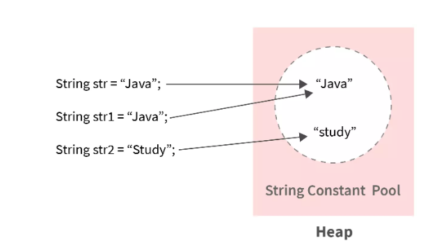
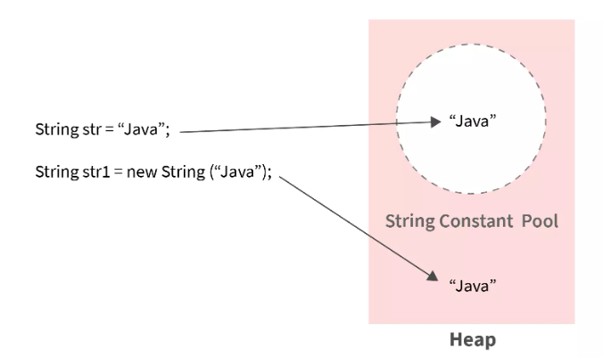
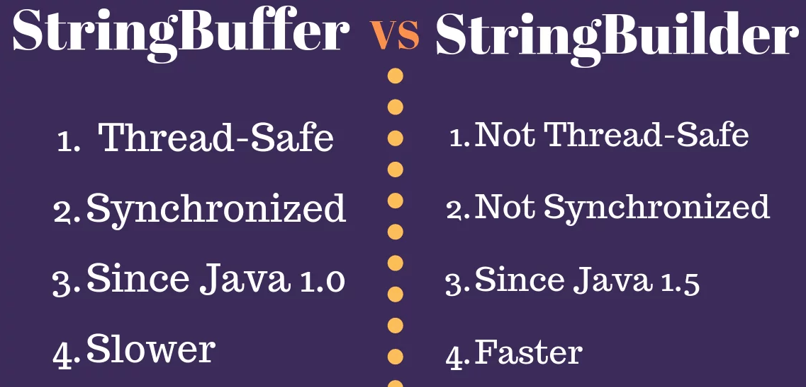

## Strings
– Collection/sequence of characters 
– Most commonly used class in the Java library; everything starting with a capital letter is a class 
– We use double quotes to represent a string in Java 
– Strings are immutable & final 

## Creating Strings in Java
– Using String Literal 
- A literal, in computer science, is a notation used for representing a value
- Java String literal can be created and represented using the double-quotes
- ex: `String scalerAcad = "Some String";` 
- Strings created using String literals are stored in a special place in heap called --> "String Constant Pool" or "String Pool"

– Using `new` keyword 
- Java compiler will create a new object and store it in the heap space reserved for the JVM 
- Every String created like this will point to a different memory region with its own address 
- ex: `String newString = new String("Baeldung");`

  
## String Pool 
– A special memory region where Strings are stored by the JVM. 
– if we create an object using String literal syntax, it may return an existing object from the String pool, if it already exists, otherwise, it will create a new String object and put in the string pool for future re-use. 
– Also, when we create a String using literal --> it is interned.

## Heap memory
– String object created using the `new()` operator, it always creates a new object in heap memory.

## String Interning
– String Interning is a method of storing only one copy of each distinct String Value, which must be immutable. 
– `intern()` helps in comparing two String objects with == operator by looking into the pre-existing pool of string literals 
– The intern() method should be used on strings constructed with new String() in order to compare them by == operator. 
– Java String intern() is a native method. When the intern() method is invoked on a String object, if the String Pool already has a String with the same value, then the reference of String from the Pool is returned. Otherwise, this string object is added to the pool and the reference is returned.

## String Comparison
– `==` operator
- The == operator compares `references` whether the references point to the same object, they dont compare the actual values

– `equals()`Method
- compares the original content of the string. It compares values of string for equality.

– `compareTo()`Method
- compareTo() method compares values lexicographically and returns an integer value that describes if first string is less than, equal to or greater than second string. 
- Suppose s1 and s2 are two String objects. If:
  - s1 == s2 : The method returns 0.
  - s1 > s2 : The method returns a positive value.
  - s1 < s2 : The method returns a negative value.

## String vs StringBuffer vs StringBuilder
– whenever we do String manipulation like concatenation, substring, etc. it generates a new String and discards the older String for garbage collection 
– String manipulation is a heavy operation and generates a lot of garbage in heap. 
– Java has provided StringBuffer and StringBuilder classes that should be used for String manipulation. 
– StringBuffer and StringBuilder are mutable objects in Java. They provide append(), insert(), delete(), and substring() methods for String manipulation.

