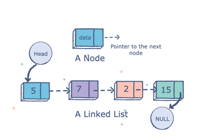

## Singly Linked List
– A linked list is a common data structure made of a chain of nodes. Not a contiguous data structure like an array, nodes can be created anywhere in the memory<br>
– Head: Reference variable which points to the `first` node in the LL<br>
– Tail: Reference variable which points to the `last` node in the LL<br>
– Last element of the list points to null<br>
– When the list is empty, the head pointer points to null<br>
– easy to insert and delete from a linked list because unlike arrays, we only need to change the pointers of the previous element and the next element to insert or delete an element.<br>
– used to create file systems, adjacency lists, and hash tables.<br>
– important to work with just the `head` 



## Node
– Each element in the Linked list is called a Node<br>
– Each node contains `data` field and a `next` field(reference variable) which points to the next node in the List<br>
– Node is represented as : 
```
class Node{
    int data;
    Node next;
}
```
