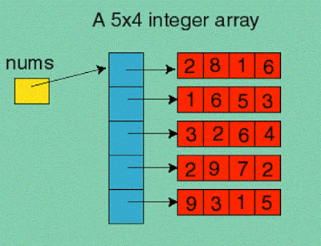

<h2>1D Array</h2>
– Container object(stored on heap) that holds fixed #(number of items that an array can store is decided at the 
array creation time, cannot be changed afterwards) values of single type(items should be of single data type, 
primitives or object references) in a contiguous memory location 
– Element --> Each item in the array 
– Arrays are index based data structure so they allow random access to elements 
– Indices start with '0'. 
– Accessing an element :`arrayName[Index_position]` 
– Arrays are objects so we can find the length of the array using attribute 'length'. 
– Java array are types. we can declare the variables of array type. 
– Just like other variables, arrays can also be static, final or used as method arguments. 
– The size of an array must be specified by an int value, accessing an element outside the array boundary --> runtime error 
– Java arrays are Cloneable and Serializable. 
– Can be visualized as a sequence of elements laid out along a line

##Arrays of Primitives
Using the new Keyword
 -`int[] myArray = new int[7];`
 -`myArray[0]=1`
 -`int[] myArray;` here myArray will be null
 - Each element will default to `0`; since `int` type
 - Though array is object --> elements are primitives
  

Declaration & Initialization in the same step
 -`int[] myArray = new int[]{1,2,3,4,5};`
  

Array Initializer
 - No new keyword
 - `int[] myArray = {1,2,3,4,5,6,7}; // no array size in between the []`

##Arrays of Object References
Using the keyword new
 -`Student[] studentArray = new Student[7];`
 -`studentArray[0]= new Student()`
 -`studentArray[1]= new Student()`
 - Each Object reference will default to `null`
 - Though array is object --> elements are primitives
  

##Random Access
– Linear layout ~ Array elements are stored contiguously, next to each other in the memory 
– fast random access, O(1), any element can be accessed in a constant time; since the starting address & datatype is known 
– Search ~ linear time O(n)

##Java run-time array index check
– Java has strict run-time check for any out of range index 
– For example if the length of the array is 10 then the index range for the array is 0-9 
– Any attempt to use index out of this range(0-9), either negative number or positive number, will result in a run-time exception ArrayIndexOutOfBoundsException 

##2D Arrays
– The 2D Array in Java programming language is nothing but an Array of Arrays 
– elements arranged in rows and columns 
– elements will be laid out in a grid form(matrix) 
  
– First square bracket represents --> number of rows 
– Second square bracket represents --> number of columns 
– 2D arrays is represented as 1D array whose elements are object references which refer to actual 1D arrays 
– ex: `int[][] myArray ={{2,8,1,6}, {1,6,5,3}, {3,2,6,4}};` 
– Accessing length property will give us number of rows --> number of 1D arrays in an Array; above --> 3

##3D Arrays
– The 3D Array in Java programming language is nothing but an Array of 2D arrays 
– ex: `int[][][] myArray ={{{2,8,1,6}, {1,6,5,3}, {3,2,6,4}}, {{20,80,10,60}, {10,60,50,30}, {30,20,60,40}}};` 
– the three dimensions are interpreted as 
- Tables/Arrays
- Rows
- Columns

– Accessing length property --> number of arrays --> number of 2D arrays in an Array; above --> 2  
– Accessing length of each 2D array --> number of rows --> number of 1D arrays in an Array --> 3  
– Accessing length of each 1D array --> number of columns --> number of elements an Array --> 4  

##Jagged Arrays
– A special feature of this type of array is that it is a Multidimensional array whose each element can have different sizes 
– While creating an array of arrays you only specify the first dimension that represents a number of rows in the array. 
– ex: `int myarray[][] = new int[3][];`
